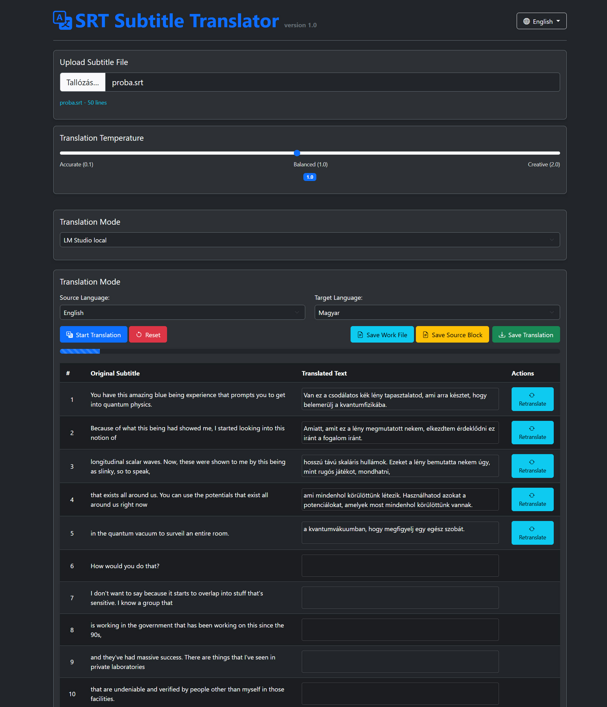

# SRT Subtitle Translator

This application is a simple yet powerful web tool for translating .srt subtitle files. The program uses either the LM Studio artificial intelligence model running on the local machine or the ChatGPT API for translation.



## Version History

### Version 1.4 (2025-03-24)
- **New OpenRouter Models**: Added five new OpenRouter models to expand translation options:
  - **DeepSeek R1** (free)
  - **Gemini Pro 2.0 Experimental** (free)
  - **DeepSeek V3** (free)
  - **Llama 3.1 70B Instruct**
  - **GPT-4o-mini**
- **Batch Translation Mode**: Batch translation mode is now available for all OpenRouter models
- Improved API key handling for all OpenRouter models
- Enhanced translation reliability when using external API services

### Version 1.3 (2025-03-23)
- Added batch mode for ChatGPT-4o mini and ChatGPT-4o models, allowing for translation of 30 lines at once
- Improved translation speed and accuracy with the batch mode for ChatGPT models
- The special large context translation mode is now available for Gemini Flash, ChatGPT-4o mini, and ChatGPT-4o models

### Version 1.2 (2025-03-22)

The latest update brings powerful performance improvements and enhanced user experience:

- **Special Large Context Translation Mode for Gemini Flash 2.0 model**: Added a batch translation mode that processes 30 lines of text at once, significantly improving translation speed, comprehension, and accuracy
- **Gemini Model Support**: Enhanced compatibility with Google's Gemini models for better performance with batch translation mode
- **Improved Tooltip System**: Added informative tooltips for the batch translation mode in all 30 supported languages
- **Interface Consistency**: Enhanced user interface to ensure all language files contain proper translations for all features, along with minor improvements to displays and translation processes to better assist with the work

## Version 1.1 Update

The latest update brings exciting new features to enhance your translation experience:

- **OpenRouter.ai API Integration**: Added support for OpenRouter.ai API, allowing access to more AI models
- **New Translation Models**:
  - **Gemma 3 27B (free)**: High-quality free model from Google via OpenRouter.ai
  - **Gemini Flash 2.0**: Premium model from Google with faster processing and higher quality translations
- **Improved Error Handling**: Enhanced error handling and response processing for more reliable translations
- **API Response Format Flexibility**: Added support for various API response formats to ensure compatibility with different models

## Features

- Modern, responsive, dark-styled user interface with Bootstrap framework
- Loading and processing .srt subtitle files
- Selection of source and target languages from 30 supported languages
- **Multilingual user interface** in 30 different languages
- Sentence-by-sentence translation of subtitles using the local LM Studio AI model or ChatGPT API
- **Translation mode selection**: LM Studio local model or ChatGPT API (GPT-4o or GPT-4o-mini)
- Visual tracking of the translation process with a progress bar
- Saving the translated subtitle file with the original timecodes and format
- **Manual editing of translations** directly in the table
- **Translation freedom degree (temperature) setting** to control creativity
- Individual retranslation of lines when needed
- **Saving and loading work files** to continue the translation process later (.wrk work files)
- **Source block saving** for saving the text-only content of source subtitles in numbered block format for external text translation
- **Loading external numbered translated lines** inserts translated lines with numbers from external sources into the corresponding numbered rows in the translation table (.mmm format text files. Can contain translations from source block saving that the program can insert into the workflow.)
- **API key storage in encrypted form** This is not perfect security, but much better than storage without encryption. Protects against casual inspection: This method protects the API key from casual inspection (e.g., if someone just looks at the localStorage content), but a determined attacker who has access to the code and localStorage can still decrypt it.

## Installation

The application is a client-side web application that doesn't require traditional installation. Follow these steps to get started:

1. **Download the application:**
   - Clone this repository or download it as a ZIP file
   - Extract the files to a folder on your computer

2. **Open the application:**
   - Open the `index.html` file in your web browser
   - Alternatively, you can use a local web server to serve the files

3. **For LM Studio integration:**
   - Download and install LM Studio from [lmstudio.ai](https://lmstudio.ai/) or their GitHub repository
   - Launch LM Studio and load a language model
   - Start the local server in LM Studio (usually at http://localhost:1234)
   - If you encounter CORS issues, see the troubleshooting section below

4. **For ChatGPT integration:**
   - Create an account on [OpenAI](https://openai.com/) if you don't have one
   - Generate an API key in your OpenAI account
   - Enter this API key in the application when prompted

5. **Start using the application:**
   - Select your preferred user interface language
   - Choose the translation mode (LM Studio or ChatGPT)
   - Load a subtitle file and start translating

No additional installation or dependencies are required as all necessary libraries are included in the package.

## User Guide

1. **Selecting translation mode:**
   - Choose the translation mode from the dropdown menu:
     - **LM Studio (local)**: Use LM Studio model running on the local machine
     - **ChatGPT (GPT-4o-mini)**: Use OpenAI GPT-4o-mini model
     - **ChatGPT (GPT-4o)**: Use OpenAI GPT-4o model

2. **Preparing LM Studio (if you selected LM Studio mode):**
   - Install and start the LM Studio application on your machine
   - Load an appropriate language model
   - Start the local server (by default at http://localhost:1234)

3. **Setting up ChatGPT API (if you selected ChatGPT mode):**
   - Enter your OpenAI API key in the field that appears
   - The API key is stored encrypted in your browser

4. **Selecting the user interface language:**
   - Click on the language selector button in the top right corner
   - Select the desired language from the 30 available languages
   - The user interface immediately updates in the selected language

5. **Loading a subtitle file:**
   - Open the webpage in your browser
   - Click the "Browse" button and select a .srt extension subtitle file or a previously saved .wrk work file

6. **Setting the translation freedom degree:**
   - Use the slider to set the creativity of the translation
   - Low value (0.1-0.7): Accurate, literal translation
   - Medium value (0.7-1.3): Balanced, natural translation
   - High value (1.3-2.0): Creative, freer translation

7. **Selecting languages:**
   - Select the source language (the language of the original subtitle)
   - Select the target language (the desired translation language)

8. **Starting translation:**
   - Click the "Start Translation" button
   - Wait for the program to translate all subtitles
   - The progress is shown by the progress bar
   - You can stop the translation at any time with the "Stop Translation" button

9. **Editing translations:**
   - Click on any translated text in the table to edit it
   - Make the desired changes
   - The changes are automatically saved when you click elsewhere
   - Edited rows briefly flash green to indicate successful saving

10. **Retranslating lines:**
    - If you want to retranslate a line, click on the retranslate icon next to the line
    - The retranslation is done using the selected translation mode and the set translation freedom degree

11. **Saving the translation:**
    - After completing the translation, click the "Save Translation" button
    - The browser will download the new subtitle file, named as a combination of the original filename and the target language code

12. **Saving and loading work files:**
    - If you want to interrupt the translation and continue later, click the "Save Work File" button
    - The browser will download a .wrk extension work file that contains all translation data
    - Later you can load this file with the "Browse" button and continue the translation from where you left off

13. **Saving source block:**
    - Click the "Save Source Block" button
    - The browser will download the text content of the source file with line numbers, divided into 50-line blocks
    - This is a useful feature if you want to highlight or handle certain parts separately, or if you want to translate on other chat interfaces

## System Requirements

- Modern web browser (Chrome, Firefox, Edge, Safari)
- For LM Studio mode: Running LM Studio application on the local machine (http://localhost:1234)
- For ChatGPT mode: Valid OpenAI API key

## Advanced Translation Features

The application includes numerous advanced translation features for more accurate and consistent translations:

### 1. Context-based Translation

During translation, we not only send the current sentence to the AI but also provide context:

- We also send the 4 sentences before the current sentence (if they exist)
- We also send the 4 sentences after the current sentence (if they exist)
- These context sentences help the AI better understand the textual environment
- Especially useful in cases where the meaning of the sentence depends on the context
- The expanded context significantly improves the quality of the translation, especially for longer dialogues and complex scenes

### 2. Translation Memory

The application uses a translation memory system to ensure consistency:

- It stores already translated sentences and their translations
- If the same sentence appears multiple times in the subtitle, it doesn't translate it again
- Ensures consistency in the translation, especially for recurring expressions
- The memory is separated by language pairs, so if we change the source or target language, a new memory is created

### 3. Translation Freedom Degree (Temperature)

Setting the translation freedom degree allows controlling the creativity of the translation:

- **Low value (0.1-0.7)**: More accurate, literal translation with less creativity. Ideal for documents, technical texts.
- **Medium value (0.7-1.3)**: Balanced translation that preserves the original meaning but uses more natural language.
- **High value (1.3-2.0)**: More creative, freer translation that better adapts to the idioms of the target language. Ideal for literary texts, dialogues.

### 4. Manual Editing

Manual editing of translations allows for fine-tuning:

- You can edit the translated text directly in the table
- The changes are automatically saved to the translation memory
- Edited rows briefly flash green to indicate successful saving
- You don't need to retranslate the entire subtitle because of a few errors

### 5. Saving and Loading Work Files

The work file feature allows interrupting and later continuing the translation process:

- The work file (.wrk) contains all translation data:
  - Original and translated subtitles
  - Current translation position
  - Language settings
  - Translation freedom degree
  - Translation memory
- You can save the work file at any time and continue the translation later
- Especially useful for longer subtitle files, or if you want to do the translation in multiple sessions
- After loading the work file, you can continue exactly where you left off

### 6. Advanced Translation Prompt

The translation prompt is designed to achieve the best possible result:

- We give detailed instructions to the AI regarding the quality of the translation
- We indicate that it's a movie subtitle, which helps the AI select the appropriate style
- We request that the translation be natural and fluent while preserving the original meaning and style

### 7. Automatic Text Cleaning

During translation, we apply automatic cleaning steps:

- Removes any quotation marks from the beginning and end of the translation
- Removes code markings and formatting if the AI would return such
- Ensures that the translated text is in the proper format for the subtitle file

### 8. Multilingual User Interface

The application's user interface is available in 30 different languages:

- We can switch between languages with the language selector button in the top right corner
- The selected language is stored in the browser, so it remains for the next visit
- All functional labels, button texts, and warning messages are automatically updated according to the selected language

## Troubleshooting

- **Connection error to LM Studio:** Make sure LM Studio is running and the local server is started at http://localhost:1234
- **Connection error to ChatGPT API:** Check that your API key is correct and you have sufficient credits
- **Translation error:** Check the browser console for detailed error messages
- **Slow translation:** The translation speed depends on the size of the language model used and the performance of the computer, or the response time of the ChatGPT API
- **Inaccurate translation:** Try using a larger or more specialized language model, or set the translation freedom degree lower
- **Editing not working:** If you have problems with editing, try refreshing the page or using a different browser
- **Work file loading error:** Check that the work file format is correct and the file is not corrupted

---------------------------------------------------------------------------------------------------------------------
MAGYAR NYELVŰ LEÍRÁS:

# SRT Felirat Fordító

Ez az alkalmazás egy egyszerű, de hatékony webes eszköz .srt formátumú feliratfájlok fordítására. A program a helyi gépen futó LM Studio mesterséges intelligencia modellt vagy a ChatGPT API-t használja a fordításhoz.

## Verzió történet

### 1.4-es verzió (2025-03-24)
- **Új OpenRouter modellek**: Öt új OpenRouter modell hozzáadása a fordítási lehetőségek bővítéséhez:
  - **DeepSeek R1** (ingyenes)
  - **Gemini Pro 2.0 Experimental** (ingyenes)
  - **DeepSeek V3** (ingyenes)
  - **Llama 3.1 70B Instruct**
  - **GPT-4o-mini**
- **Kötegelt fordítási mód**: Kötegelt fordítási mód most már elérhető minden OpenRouter modellhez
- Javított API kulcs kezelés minden OpenRouter modellhez
- Fejlesztett fordítási megbízhatóság külső API szolgáltatások használata esetén

### 1.3-as verzió (2025-03-23)
- ChatGPT-4o mini és ChatGPT-4o modellekhez is hozzáadtuk a batch módot, amely egyszerre 30 sor szöveget képes feldolgozni
- Javított fordítási sebesség és pontosság a ChatGPT modellek batch módjával
- A speciális nagy kontextusú fordítási mód most már elérhető a Gemini Flash, ChatGPT-4o mini és ChatGPT-4o modellekhez

### 1.2-es verzió (2025-03-22)

A legújabb frissítés hatékony teljesítménybeli javításokat és továbbfejlesztett felhasználói élményt kínál:

- **Speciális nagy kontextusú fordítási mód a Gemini Flash 2.0 modellhez**: Hozzáadtunk egy kötegelt fordítási módot, amely egyszerre 30 sor szöveget dolgoz fel, jelentősen javítva a fordítási sebességet, szövegértést és pontosságot
- **Gemini modell támogatás**: Továbbfejlesztett kompatibilitás a Google Gemini modelljeivel a kötegelt fordítási mód jobb teljesítménye érdekében
- **Továbbfejlesztett tooltip rendszer**: Informatív tooltipek hozzáadása a kötegelt fordítási módhoz mind a 30 támogatott nyelven
- **Felhasználói felület konzisztencia**: Továbbfejlesztett felhasználói felület, amely biztosítja, hogy minden nyelvi fájl megfelelő fordításokat tartalmazzon, illetve a munkát még jobban segítő apróbb változtatások a megelenítések és a fordítási folyamatok során.

## 1.1-es verzió frissítés

A korábbi frissítés izgalmas új funkciókat kínált a fordítási élmény javítására:

- **OpenRouter.ai API integráció**: Az OpenRouter.ai API támogatása, amely több AI modellhez biztosít hozzáférést
- **Új fordítási modellek**:
  - **Gemma 3 27B (ingyenes)**: Kiváló minőségű ingyenes modell a Google-tól az OpenRouter.ai-n keresztül
  - **Gemini Flash 2.0**: Prémium modell a Google-tól gyorsabb feldolgozással és jobb minőségű fordításokkal
- **Javított hibakezelés**: Továbbfejlesztett hibakezelés és válasz feldolgozás a megbízhatóbb fordításokért
- **API válasz formátum rugalmasság**: Különböző API válasz formátumok támogatása a különböző modellekkel való kompatibilitás biztosítása érdekében

## Funkciók

- Modern, reszponzív, dark stílusú felhasználói felület Bootstrap keretrendszerrel
- .srt feliratfájlok betöltése és feldolgozása
- Forrásnyelv és célnyelv kiválasztása 30 támogatott nyelvből
- **Többnyelvű felhasználói felület** 30 különböző nyelven
- Feliratok mondatonkénti fordítása a helyi LM Studio AI modell vagy a ChatGPT API segítségével
- **Fordítási mód választás**: LM Studio helyi modell vagy ChatGPT API (GPT-4o vagy GPT-4o-mini)
- Fordítási folyamat vizuális követése haladásjelzővel
- Lefordított feliratfájl mentése az eredeti időkódokkal és formátummal
- **Fordítások manuális szerkesztése** közvetlenül a táblázatban
- **Fordítási szabadságfok (temperature) beállítása** a kreativitás szabályozásához
- Sorok egyenkénti újrafordítása szükség esetén
- **Munkafájl mentése és betöltése** a fordítási folyamat későbbi folytatásához (.wrk munkafájlok)
- **Forrás blokk mentése** a forrás feliratok csak szöveges tartalmának sorszámozottblokk formátumban történő mentése külső szöveges fordításhoz.
- **Külső sorszámozott fordított sorok betöltése** külső forrásból származó és sorszámmal ellátott fordított sorokat beilleszt a fordítás táblázat azonos sorszámú soraiba a program (.mmm formátumú szövegfájlok. A forrás blokkmentés fordításait tartalmazhatja, amit a program be tud illeszteni a munkafolyamatba.)
- **API kulcs titkosított formában tárolása** Ez nem tökéletes biztonság, de sokkal jobb, mint a titkosítás nélküli tárolás. Véd a felületes vizsgálat ellen: Ez a módszer megvédi az API kulcsot a felületes vizsgálattól (pl. ha valaki csak megnézi a localStorage tartalmát), de egy elszánt támadó, aki hozzáfér a kódhoz és localStorage-hoz, még mindig visszafejtheti.

## Telepítés

Az alkalmazás egy kliens-oldali webalkalmazás, amely nem igényel hagyományos telepítést. Kövesd ezeket a lépéseket a kezdéshez:

1. **Az alkalmazás letöltése:**
   - Klónozd ezt a repository-t vagy töltsd le ZIP fájlként
   - Csomagold ki a fájlokat egy mappába a számítógépeden

2. **Az alkalmazás megnyitása:**
   - Nyisd meg az `index.html` fájlt a webböngésződben
   - Alternatívaként használhatsz helyi webszervert a fájlok kiszolgálásához

3. **LM Studio integrációhoz:**
   - Töltsd le és telepítsd az LM Studio-t a [lmstudio.ai](https://lmstudio.ai/) oldalról vagy a GitHub repository-jukból
   - Indítsd el az LM Studio-t és tölts be egy nyelvi modellt
   - Indítsd el a helyi szervert az LM Studio-ban (általában a http://localhost:1234 címen)
   - Ha CORS problémákba ütközöl, nézd meg a hibaelhárítás részt lentebb

4. **ChatGPT integrációhoz:**
   - Hozz létre egy fiókot az [OpenAI](https://openai.com/) oldalon, ha még nincs
   - Generálj egy API kulcsot az OpenAI fiókodban
   - Add meg ezt az API kulcsot az alkalmazásban, amikor kéri

5. **Az alkalmazás használatának megkezdése:**
   - Válaszd ki a kívánt felhasználói felület nyelvet
   - Válaszd ki a fordítási módot (LM Studio vagy ChatGPT)
   - Tölts be egy feliratfájlt és kezdd el a fordítást

Nincs szükség további telepítésre vagy függőségekre, mivel minden szükséges könyvtár megtalálható a csomagban.

## Használati útmutató

1. **Fordítási mód kiválasztása:**
   - Válaszd ki a fordítási módot a legördülő menüből:
     - **LM Studio (helyi)**: Helyi gépen futó LM Studio modell használata
     - **ChatGPT (GPT-4o-mini)**: OpenAI GPT-4o-mini modell használata
     - **ChatGPT (GPT-4o)**: OpenAI GPT-4o modell használata

2. **LM Studio előkészítése (ha LM Studio módot választottál):**
   - Telepítsd és indítsd el az LM Studio alkalmazást a gépeden
   - Tölts be egy megfelelő nyelvi modellt
   - Indítsd el a helyi szervert (alapértelmezetten a http://localhost:1234 címen)

3. **ChatGPT API beállítása (ha ChatGPT módot választottál):**
   - Add meg az OpenAI API kulcsodat a megjelenő mezőben
   - Az API kulcs titkosítva tárolódik a böngésződben

4. **Felhasználói felület nyelvének kiválasztása:**
   - Kattints a jobb felső sarokban található nyelvválasztó gombra
   - Válaszd ki a kívánt nyelvet a 30 elérhető nyelvből
   - A felhasználói felület azonnal frissül a kiválasztott nyelven

5. **Feliratfájl betöltése:**
   - Nyisd meg a weboldalt a böngésződben
   - Kattints a "Tallózás" gombra és válassz ki egy .srt kiterjesztésű feliratfájlt vagy egy korábban mentett .wrk munkafájlt

6. **Fordítási szabadságfok beállítása:**
   - Használd a csúszkát a fordítás kreativitásának beállításához
   - Alacsony érték (0.1-0.7): Pontos, szó szerinti fordítás
   - Közepes érték (0.7-1.3): Kiegyensúlyozott, természetes fordítás
   - Magas érték (1.3-2.0): Kreatív, szabadabb fordítás

7. **Nyelvek kiválasztása:**
   - Válaszd ki a forrásnyelvet (az eredeti felirat nyelve)
   - Válaszd ki a célnyelvet (a kívánt fordítás nyelve)

8. **Fordítás indítása:**
   - Kattints a "Fordítás indítása" gombra
   - Várd meg, amíg a program lefordítja az összes feliratot
   - A folyamat előrehaladását a haladásjelző mutatja
   - Bármikor megállíthatod a fordítást a "Fordítás leállítása" gombbal

9. **Fordítások szerkesztése:**
   - Kattints bármelyik lefordított szövegre a táblázatban a szerkesztéshez
   - Végezd el a kívánt módosításokat
   - A módosítások automatikusan mentésre kerülnek, amikor máshova kattintasz
   - A szerkesztett sorok rövid zöld villanással jelzik a sikeres mentést

10. **Sorok újrafordítása:**
    - Ha egy sort újra szeretnél fordíttatni, kattints a sor mellett található újrafordítás ikonra
    - Az újrafordítás a kiválasztott fordítási móddal és a beállított fordítási szabadságfok szerint történik

11. **Fordítás mentése:**
    - A fordítás befejezése után kattints a "Fordítás mentése" gombra
    - A böngésző letölti az új feliratfájlt, amelynek neve az eredeti fájlnév és a célnyelv kódjának kombinációja

12. **Munkafájl mentése és betöltése:**
    - Ha szeretnéd megszakítani a fordítást és később folytatni, kattints a "Munkafájl mentése" gombra
    - A böngésző letölti a .wrk kiterjesztésű munkafájlt, amely tartalmazza az összes fordítási adatot
    - Később betöltheted ezt a fájlt a "Tallózás" gombbal, és folytathatod a fordítást onnan, ahol abbahagytad

13. **Forrás blokk mentése:**
    - Kattints a "Forrás blokkmentése" gombra
    - A böngésző letölti a forrásfájl szöveges tartalmát sorzámmal ellátva 50 soros blokkokra osztva.
    - Hasznos funkció, ha csak bizonyos részeket szeretnél kiemelni vagy külön kezelni, illetve lehetőséget ad más chat felületeken történő fordításra.

## Rendszerkövetelmények

- Modern webböngésző (Chrome, Firefox, Edge, Safari)
- LM Studio mód esetén: Futó LM Studio alkalmazás a helyi gépen (http://localhost:1234)
- ChatGPT mód esetén: Érvényes OpenAI API kulcs

## Fejlett fordítási funkciók

Az alkalmazás számos fejlett fordítási funkciót tartalmaz a pontosabb és konzisztensebb fordítások érdekében:

### 1. Kontextus alapú fordítás

A fordítás során nem csak az aktuális mondatot küldjük el az AI-nak, hanem kontextust is adunk neki:

- Az aktuális mondat előtti 4 mondatot is elküldjük (ha léteznek)
- Az aktuális mondat utáni 4 mondatot is elküldjük (ha léteznek)
- Ezek a kontextus mondatok segítenek az AI-nak jobban megérteni a szövegkörnyezetet
- Különösen hasznos olyan esetekben, amikor a mondat jelentése a kontextustól függ
- A bővített kontextus jelentősen javítja a fordítás minőségét, különösen hosszabb párbeszédek és összetett jelenetek esetén

### 2. Fordítási memória

Az alkalmazás fordítási memória rendszert használ a konzisztencia biztosítására:

- Eltárolja a már lefordított mondatokat és fordításaikat
- Ha ugyanaz a mondat többször is előfordul a feliratban, akkor nem fordítja le újra
- Biztosítja a konzisztenciát a fordításban, különösen ismétlődő kifejezések esetén
- A memória nyelvpáronként elkülönül, tehát ha változtatunk a forrás- vagy célnyelven, új memória jön létre

### 3. Fordítási szabadságfok (Temperature)

A fordítási szabadságfok beállítása lehetővé teszi a fordítás kreativitásának szabályozását:

- **Alacsony érték (0.1-0.7)**: Pontosabb, szó szerinti fordítás, kevesebb kreativitással. Ideális dokumentumokhoz, technikai szövegekhez.
- **Közepes érték (0.7-1.3)**: Kiegyensúlyozott fordítás, amely megőrzi az eredeti jelentést, de természetesebb nyelvezetet használ.
- **Magas érték (1.3-2.0)**: Kreatívabb, szabadabb fordítás, amely jobban alkalmazkodik a célnyelv idiómáihoz. Ideális irodalmi szövegekhez, párbeszédekhez.

### 4. Manuális szerkesztés

A fordítások manuális szerkesztése lehetővé teszi a finomhangolást:

- Közvetlenül a táblázatban szerkesztheted a fordított szöveget
- A módosítások automatikusan mentésre kerülnek a fordítási memóriába
- A szerkesztett sorok rövid zöld villanással jelzik a sikeres mentést
- Nem kell újrafordítanod az egész feliratot egy-egy hiba miatt

### 5. Munkafájl mentése és betöltése

A munkafájl funkció lehetővé teszi a fordítási folyamat megszakítását és későbbi folytatását:

- A munkafájl (.wrk) tartalmazza az összes fordítási adatot:
  - Eredeti és lefordított feliratok
  - Aktuális fordítási pozíció
  - Nyelvi beállítások
  - Fordítási szabadságfok
  - Fordítási memória
- Bármikor elmentheted a munkafájlt és később folytathatod a fordítást
- Különösen hasznos hosszabb feliratfájlok esetén, vagy ha több részletben szeretnéd elvégezni a fordítást
- A munkafájl betöltése után pontosan onnan folytathatod, ahol abbahagytad

### 6. Fejlett fordítási prompt

A fordítási prompt-ot úgy terveztük, hogy a lehető legjobb eredményt érje el:

- Részletes utasításokat adunk az AI-nak a fordítás minőségével kapcsolatban
- Jelezzük, hogy filmfeliratról van szó, ami segít az AI-nak a megfelelő stílus kiválasztásában
- Kérjük, hogy a fordítás természetes és folyékony legyen, miközben megőrzi az eredeti jelentést és stílust

### 7. Automatikus szövegtisztítás

A fordítás során automatikus tisztítási lépéseket alkalmazunk:

- Eltávolítja az esetleges idézőjeleket a fordítás elejéről és végéről
- Eltávolítja a kódjelöléseket és formázásokat, ha az AI ilyeneket adna vissza
- Biztosítja, hogy a fordított szöveg megfelelő formátumban kerüljön a feliratfájlba

### 8. Többnyelvű felhasználói felület

Az alkalmazás felhasználói felülete 30 különböző nyelven érhető el:

- A jobb felső sarokban található nyelvválasztó gombbal válthatunk a nyelvek között
- A kiválasztott nyelv szerint az alkalmazás összes funkcionális felirata, nyomógomb szövege és figyelmeztető üzenete automatikusan frissül
- A nyelvi beállítás a böngésző localStorage-jában tárolódik, így a felhasználó következő látogatásakor is megmarad

## Hibaelhárítás

- **A fordítás nem indul el (LM Studio mód):** Ellenőrizd, hogy az LM Studio fut-e és elérhető-e a http://localhost:1234 címen
- **A fordítás nem indul el (ChatGPT mód):** Ellenőrizd, hogy megadtad-e az érvényes OpenAI API kulcsot
- **Fordítási hiba:** Ellenőrizd a böngésző konzolját a részletes hibaüzenetért
- **Lassú fordítás:** A fordítás sebessége függ a használt nyelvi modell méretétől és a számítógép teljesítményétől, illetve a ChatGPT API válaszidejétől
- **Pontatlan fordítás:** Próbálj nagyobb vagy specializáltabb nyelvi modellt használni, vagy állítsd alacsonyabbra a fordítási szabadságfokot
- **Szerkesztés nem működik:** Ha problémád van a szerkesztéssel, próbáld frissíteni az oldalt, vagy használj más böngészőt
- **Munkafájl betöltési hiba:** Ellenőrizd, hogy a munkafájl formátuma megfelelő-e, és nem sérült-e a fájl
- **API kulcs nem mentődik:** Ellenőrizd, hogy a böngésződ támogatja-e a localStorage használatát és nincs-e letiltva

## Technikai információk
- Az alkalmazás tisztán kliens-oldali, nem igényel szervert
- A fordítás az LM Studio API-ján keresztül történik a `/v1/completions` végponton vagy a ChatGPT API-n keresztül
- A program nem küld adatokat külső szerverekre, kivéve a ChatGPT API-t, ha azt a fordítási módot választottad
- A munkafájlok JSON formátumban tárolódnak, és tartalmazzák az összes szükséges adatot a fordítás folytatásához
- Az API kulcsok AES titkosítással tárolódnak a böngésző localStorage-jában

### CORS hibák kezelése LM Studio használatakor

Az LM Studio helyi szerverének használatakor előfordulhatnak CORS (Cross-Origin Resource Sharing) hibák, amelyek megakadályozhatják, hogy a böngésző kommunikáljon a helyi API-val. Ez a biztonsági korlátozás a böngészőkben megakadályozza, hogy egy weboldal más forrásból származó erőforrásokat érjen el, ha az a forrás nem engedélyezi kifejezetten a hozzáférést.

#### CORS hibák jelei:
- A fordítás nem indul el, vagy hibára fut
- A böngésző konzoljában "Access to fetch at 'http://localhost:1234/v1/completions' from origin 'null' has been blocked by CORS policy" típusú hibaüzenet jelenik meg

#### Megoldási lehetőségek:

1. **CORS Everywhere bővítmény használata (ajánlott)**:
   - Telepítsd a "CORS Everywhere" vagy hasonló CORS-feloldó bővítményt a böngésződhöz
   - Firefox: [CORS Everywhere](https://addons.mozilla.org/en-US/firefox/addon/cors-everywhere/)
   - Chrome: [CORS Unblock](https://chrome.google.com/webstore/detail/cors-unblock/lfhmikememgdcahcdlaciloancbhjino)
   - Aktiváld a bővítményt, amikor az alkalmazást használod
   - **Fontos**: Biztonsági okokból csak akkor aktiváld a bővítményt, amikor erre az alkalmazásra van szükséged, és használat után deaktiváld

2. **LM Studio beállítása CORS engedélyezésére**:
   - Az LM Studio újabb verziói támogatják a CORS fejlécek beállítását
   - A szerver indításakor a beállításokban engedélyezd a CORS-t
   - Részletes útmutatásért ellenőrizd az LM Studio dokumentációját

3. **Helyi webszerver használata**:
   - Futtass egy egyszerű helyi webszervert (pl. Python http.server, Node.js http-server)
   - Nyisd meg az alkalmazást a webszerver által szolgáltatott URL-en (pl. http://localhost:8000)
   - Ez gyakran megoldja a CORS problémákat, mivel a weboldal és az API ugyanarról a forrásról (localhost) származik

4. **Parancssori indítás speciális paraméterekkel**:
   - Chrome böngésző indítása CORS ellenőrzés kikapcsolásával (csak teszteléshez):
     ```
     chrome.exe --disable-web-security --user-data-dir="C:/ChromeDevSession"
     ```
   - **Figyelem**: Ez biztonsági kockázatot jelent, csak tesztelési célokra használd, és ne böngéssz más oldalakat ebben a böngészőablakban

#### Biztonsági figyelmeztetés:
A CORS korlátozások megkerülése biztonsági kockázatot jelenthet. Csak megbízható helyi alkalmazásokkal (mint az LM Studio) használd ezeket a megoldásokat, és csak addig, amíg szükséges.
